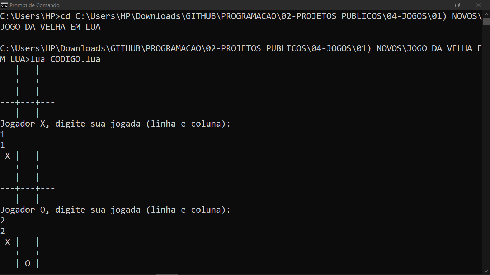
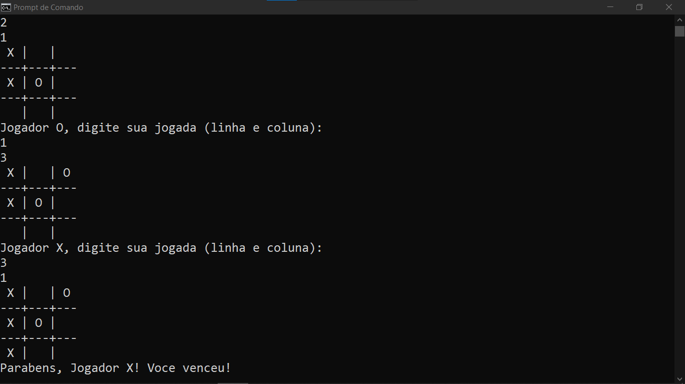

# JOGO DA VELHA EM LUA
👨‍💻ESSE É PEQUENO JOGO QUE RODA NO CONSOLE DA IDE.

 <br>
 <br>

## DESCRIÇÃO:
O Jogo da Velha é um jogo para dois jogadores onde eles se alternam para marcar espaços em uma grade 3x3. O objetivo é alinhar três símbolos consecutivos (X ou O) na horizontal, vertical ou diagonal.

## EXECUTANDO O JOGO:
1. Entre no Diretório `./CODIGO` e execute o código em um ambiente Lua com o comando:
   ```bash
   lua CODIGO.lua
   ```

2. **Início do Jogo:**
   - Ao iniciar o jogo, você verá o tabuleiro vazio.

3. **Jogada:**
   - Os jogadores se alternam para inserir suas jogadas.
   - Cada jogador deve digitar a linha e a coluna onde deseja marcar seu símbolo. A entrada deve ser dois números separados por espaço (por exemplo, `1 2` para a linha 1, coluna 2).

4. **Objetivo:**
   - O objetivo é alinhar três de seus símbolos (X ou O) na horizontal, vertical ou diagonal.

5. **Fim do Jogo:**
   - O jogo termina quando um jogador vence ou quando o tabuleiro está cheio e não há vencedores (empate).
   - Após o término, o jogo informará quem venceu ou se houve um empate.

## NÃO SABE?
- Entendemos que para manipular arquivos em muitas linguagens e tecnologias, é necessário possuir conhecimento nessas áreas. Para auxiliar nesse aprendizado, oferecemos cursos gratuitos disponíveis:
* [CURSO DE LUA](https://github.com/VILHALVA/CURSO-DE-LUA)
* [CONFIRA MAIS CURSOS](https://github.com/VILHALVA?tab=repositories&q=+topic:CURSO)

## CREDITOS:
- [PROJETO CRIADO PELO VILHALVA](https://github.com/VILHALVA)
